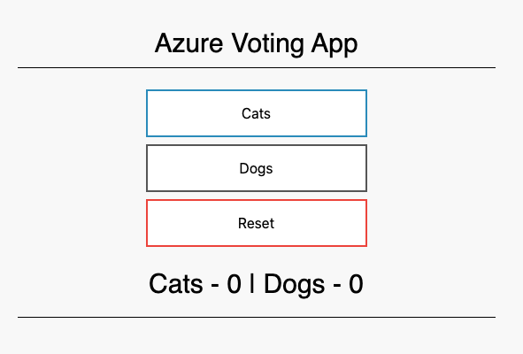

# Securing Microsoft Azure Kubernetes Service (AKS) with Snyk

Welcome! This workshop will provide you with sample patterns and reference 
architectures for securing Microsoft Azure workloads running on Microsoft AKS with Snyk. We will provide
you with step-by-step examples and sample code that will walk you through 
deployment of supporting infrastructure, sample applications, and configuration 
of the various Snyk integrations to Microsoft Azure.

## Prerequisites

In order to complete the exercises in this workshop, you will need both a 
[Microsoft Azure](https://azure.microsoft.com/) & [Snyk](https://snyk.io/) account.
- [Create](https://azure.microsoft.com/en-us/free) a free Microsoft Azure account.
- [Create](https://snyk.io/login) a free Snyk account.

## Getting Started

### Configure the local environment

Most of the work we will do will involve using the [Azure Command-Line Interface 
(CLI)](https://docs.microsoft.com/en-us/cli/azure/?view=azure-cli-latest). Detailed
documentation on installing the Azure CLI for [Windows](https://docs.microsoft.com/en-us/cli/azure/install-azure-cli-windows?view=azure-cli-latest), 
[macOS](https://docs.microsoft.com/en-us/cli/azure/install-azure-cli-macos?view=azure-cli-latest), and
[Linux](https://docs.microsoft.com/en-us/cli/azure/install-azure-cli-yum?view=azure-cli-latest) is available in 
[Azure documentation](https://docs.microsoft.com/en-us/azure/). These examples will be based on macOS.

#### Install Homebrew

If you don't already have it, [install Homebrew](https://docs.brew.sh/Installation.html) then install 
the Azure CLI with the following command:

```bash
brew update && brew install azure-cli
```

#### Authenticate with the Azure CLI

Once installed, you will need to sign in to your Azure account from the CLI. 
Run the following command:

```bash
az login
```

The CLI will attempt to open your default browser and load the Azure login page. Provide your Azure account
credentials in the browser and upon successfull authentication you will see the 
following response in your browser window:


If you encounter a problem, please review the [Install Azure CLI on macOS](https://docs.microsoft.com/en-us/cli/azure/install-azure-cli-macos?view=azure-cli-latest)
documentation pages for additional guidance.

## Provision Azure services

In order to understand the various Snyk integration points to Azure, we are going to
deploy and configure some supporting resources. The objective for these exercises is to demonstrate
how Snyk secures your workloads. We will provide basic patterns intended for use
in learning environments. For a deeper dive and learning more about Azure, we suggest
referencing Microsoft's self-paced [training modules](https://docs.microsoft.com/en-us/learn/browse/?products=azure).

### Deploy Azure Kubernetes Service (AKS)

The following examples are based on an [Azure Quickstart](https://docs.microsoft.com/en-us/azure/aks/kubernetes-walkthrough) 
for deploying AKS using the CLI. We will deploy a cluster as well as a sample
multi-container application. The application will include both a web front end
as well as a Redis instance.

#### Create a resource group

We begin by creating an [Azure resource group](https://docs.microsoft.com/en-us/learn/modules/control-and-organize-with-azure-resource-manager/2-principles-of-resource-groups)
to logical organize the resources we will deploy and manage. Here, we will also define
the location where our resources will run in Azure. In this case, we will deploy to the
`eastus` location. From your terminal, run the following command:

```bash
az group create --name mySnykAKSResourceGroup --location eastus
```

When successfully completed, you will see output similar to the following:

```json
{
  "id": "/subscriptions/<guid>/resourceGroups/mySnykAKSResourceGroup",
  "location": "eastus",
  "managedBy": null,
  "name": "mySnykAKSResourceGroup",
  "properties": {
    "provisioningState": "Succeeded"
  },
  "tags": null,
  "type": "Microsoft.Resources/resourceGroups"
}
```

You can also validate the creation of the resource group in the Azure portal as illustrate below:


#### Create the AKS cluster

Next, we are going to create a cluster named `mySnykAKSCluster` in our recently created 
`mySnykAKSResourceGroup`. Our cluster will have one node and will have monitoring enabled.

```bash
az aks create --resource-group mySnykAKSResourceGroup --name mySnykAKSCluster --node-count 1 --enable-addons monitoring --generate-ssh-keys
```

This may take several minutes to complete. You will see the following outputs in the terminal:

```text
Finished service principal creation[##########################]  100.0000%
- Running...
AAD role propagation done[[##########################]  100.0000%
```

Once the deployment completes the CLI will return a lengthy JSON response containing
details about your cluster. You can also view this within the Azure portal:


#### Connect to the cluster

To manage our AKS cluster, we will use [kubectl](https://kubernetes.io/docs/user-guide/kubectl/).
Since we are using the Azure CLI, we will need to install `kubectl` with the following
command:

```bash
az aks install-cli
```

Next, we will need to configure `kubectl` to connect to AKS by downloading
our credentials and configuring the CLI to use these. 

```bash
az aks get-credentials --resource-group mySnykAKSResourceGroup --name mySnykAKSCluster
```

If successful, you should see output similar to this:

```text
Merged "mySnykAKSCluster" as current context in $HOME/.kube/config
```

Now, we are ready to verify our connection to our cluster.

```bash
kubectl get nodes
```

When the node is ready, you should see an example output similar to the following:

```text
NAME                                STATUS   ROLES   AGE   VERSION
aks-nodepool1-27048785-vmss000000   Ready    agent   5m    v1.15.10
```

#### Deploy a sample application

We will deploy our sample application using a [Kubernetes manifest](https://docs.microsoft.com/en-us/azure/aks/concepts-clusters-workloads#deployments-and-yaml-manifests)
file. A sample file named `azure-vote.yaml` is provided for your convenience. The manifest 
includes two Kubernetes deployments: one for a sample Azure Vote Python application and 
the other for a [Redis](https://redislabs.com/) instance. Two Kubernetes [services](https://docs.microsoft.com/en-us/azure/aks/concepts-network#services) are also created:
one is an internal service for the Redis instance and the other is an external service to allow access to the application from the 
internet.

If you have cloned the repository and are working from the local directory, run the following command 
to deploy the application from the `YAML` manifest:

```bash
kubectl apply -f templates/azure-vote.yaml
```

If successful, you should see output similar to the following:

```text
deployment "azure-vote-back" created
service "azure-vote-back" created
deployment "azure-vote-front" created
service "azure-vote-front" created
```

#### Test the application

We will invoke the [kubectl get service](https://kubernetes.io/docs/reference/generated/kubectl/kubectl-commands#get) from our CLI with the
`--watch` argument to monitor the application deployment and obtain the `EXTERNAL-IP` of 
the `LoadBalancer`. 

Run the following command:

```bash
kubectl get service azure-vote-front --watch
```

While the application is deploying you may see output similar to the following:

```text
NAME               TYPE           CLUSTER-IP   EXTERNAL-IP   PORT(S)        AGE
azure-vote-front   LoadBalancer   10.0.37.27   <pending>     80:30572/TCP   6s
```

Note that `EXTERNAL-IP` displays a status of `pending`. Wait until this displays a valid
public IP address then copy and paste this value into your web browser.

Your browser should resolve and display the following:



## Setup the Snyk account

Visit [https://snyk.io](https://snyk.io) and log in.


If you do not have an account, you can [sign up](https://app.snyk.io/signup) for a 
free account. Snyk offers a [free plan](https://snyk.io/plans/) which includes:

- Unlimited tests on open-source projects
- 200 tests for open source vulnerabilities on private projects and 100 tests for container vulnerabilities
- Fixes for open source and container vulnerabilities
- CLI scans
- Cloud source code integration to GitHub, Azure Repos, and others
- CI/CD pipeline integration
- Continuous monitoring
- Public container registry integration to ACR and others
- Helm plugin to test images from Helm charts

### Configure the Kubernetes integration

From the Snyk web console, navigate to `Integrations`. Search and select
`Kubernetes`. Click `Connect` and copy the `Integration ID` to your clipboard.
The `Integration ID` will be a UUID with a format similar to `abcd1234-abcd-1234-abcd-1234abcd1234`.


Let's create an environment variable for our `Integration ID`:

```bash
IntegrationId=<value>
```

#### Install the Snyk controller

From the terminal, ensure that you have helm installed by running the following command:

```bash
brew update && brew install helm
```

Then, add the Snyk Charts repository to Helm with the following command:

```bash
helm repo add snyk-charts https://snyk.github.io/kubernetes-monitor/
```

If successful, you will see output similar to the following:

```text
"snyk-charts" has been added to your repositories
```

Once added, we will need to create a unique namespace for the Snyk controller. Run the following
command:

```bash
kubectl create namespace snyk-monitor
```

If successful, you will see output similar to the following:

```text
namespace/snyk-monitor created
```

The Snyk monitor runs by using your Snyk `Integration ID`, and using a `dockercfg` file. If you are not using any 
private registries, create a Kubernetes secret called `snyk-monitor` containing the Snyk `Integration ID` from the 
previous step and run the following command:


```bash
kubectl create secret generic snyk-monitor -n snyk-monitor \
        --from-literal=dockercfg.json={} \
        --from-literal=integrationId=$IntegrationId 
```

If successful, you will see output similar to the following:

```text
secret/snyk-monitor created
```

Now, install the Snyk Helm chart to your AKS cluster:

```bash
helm upgrade --install snyk-monitor snyk-charts/snyk-monitor \
             --namespace snyk-monitor \
             --set clusterName="mySnykAKSCluster" 
```

If successful, you will see output similar to the following:

```text
Release "snyk-monitor" does not exist. Installing it now.
NAME: snyk-monitor
LAST DEPLOYED: Tue Apr 28 16:34:04 2020
NAMESPACE: snyk-monitor
STATUS: deployed
REVISION: 1
TEST SUITE: None
```

We can also validate our pod is running with the following command:

```bash
kubectl get pods --namespace snyk-monitor
```

You will want to see the `STATUS` display `Running` as in the following example output:

```text
NAME                            READY   STATUS    RESTARTS   AGE
snyk-monitor-544ff7ccd9-qkwj8   1/1     Running   0          4m47s
```

Note that Snyk Monitor will require outbound internet access. 

#### Add Kubernetes workloads

Now that our controller has been installed on our AKS cluster, we can add workloads for security scanning. Visit the
[Snyk Knowledge Center](https://support.snyk.io/hc/en-us/articles/360003947117-Adding-Kubernetes-workloads-for-security-scanning) for
additional information on this topic. For the purpose of this section, we will
manually add some workloads. To do so, go to the Snyk web console and navigate to 
`Integrations`.


Either type `Kubernetes` in the search bar, or scroll down.


You can monitor multiple clusters across multiple environments. If your controller is 
communicating with the Snyk APIs, you will see it appear in the Snyk console. Select the
appropriate cluster you wish to monitor, the relevant namespace, and the specific workloads. Finally 
click the `Add selected workloads` button in the top right corner when you've made all
of your selections as illustrated below:


After adding the workloads you will be redirected to the `Projects` page in the Snyk console
where you will be able to view the results and take action. You can also view the `Import log` for a detailed status of 
the progress.
                                                            


### Interpret scan results

The `Projects` page will contain an inventory of all projects added and a high level
summary of findings. You can expand on a particular project to learn more about vulnerabilities that 
may have been found and guidance on how to fix these or optimizations. Let's walk through some examples.

The figure below shows the two workloads we imported in the previous section. These have been expanded to 
show that the results are including two key areas: Kubernetes configuration and container image scan results.
Clicking on each of these will present you with additional insights.


Let's begin with examining our Kubernetes configuration by click on each respective workload.


The results above yield some interesting findings. From this view, we are able to see a summary of `Vulnerabilities`, 
number of `Dependencies`, and our `Security configuration`. Let's take a closer look and 
interpret what these results mean.

If we examine the `azure-vote.yaml` manifest we applied to our Kubernetes cluster, we can see that we defined some
parameters such as `cpu` and `memory` limits. As a result, these were not flagged during the scan. 

```yaml
          resources:
            requests:
              cpu: 100m
              memory: 128Mi
            limits:
              cpu: 250m
              memory: 256Mi
```

However, our manifest did not set `securityContext` parameters such as `readOnlyRootFilesystem`, `runAsNonRoot`,
`allowPrivilegeEscalation`, and `capabilities`. As a result, we see this in our findings with the 
`FAIL` flag. 

- Run as non-root: Whether any containers in the workload have `container.securityContext.runAsNonRoot` set to `false` or unset.
- Read-only root file system: Whether any containers in the workload have `container.securityContext.readOnlyFilesystem` set to `false` or unset.
- Drop capabilities: Whether all capabilities are dropped and `CAP_SYS_ADMIN` is not added.

Next, let's take a closer look at our container image results:


Here we are immediately advised that a `Dockerfile` is missing. We know this to be true, because our deployment consisted 
of a manifest file that is pulling an image from a public registry. In the case of our `vote-back` and 
`vote-front` applications we are pulling the [image](https://kubernetes.io/docs/concepts/containers/images/) from
`redis` and `microsoft/azure-vote-front:v1` respectively. 

A best practice here would be to include a `Dockerfile` in our Git repo and pull the image from our private
registry. That way we can resolve any issues with our base images and also scan & monitor those through Snyk's integrations to
[Azure Repos](https://support.snyk.io/hc/en-us/articles/360004002198-Azure-Repos-integration) and 
[Azure Container Registry (ACR)](https://support.snyk.io/hc/en-us/articles/360003946957-Container-security-with-ACR-integrate-and-test).

We will dive into these in a later workshop.

### Fix issues

As we now know, Kubernetes is not secure by default. It is beyond the scope of these 
exercises to provide a deep-dive on this topic, but detailed documentation on [securing a cluster](https://kubernetes.io/docs/tasks/administer-cluster/securing-a-cluster/)
is readily available. Additional reading is recommended on configuring a [security context](https://kubernetes.io/docs/tasks/configure-pod-container/security-context/) for a pod, 
[pod security](https://kubernetes.io/docs/concepts/policy/pod-security-policy/) policies, and setting [capabilities](https://kubernetes.io/docs/tasks/configure-pod-container/security-context/#set-capabilities-for-a-container) for a container.

However, for the time being, we will introduce a couple of quick changes to improve our security posture. We will accomplish this by adding a few
lines to our Kubernetes manifest.

```yaml
          securityContext:
            allowPrivilegeEscalation: false
            readOnlyRootFilesystem: true
            runAsNonRoot: true
            capabilities:
              drop:
                - all
```

For your convenience, a sample file has already been created for you containing these changes. It is named
`azure-vote-secure.yaml` and can be found in the `templates/` directory of the repository for this workshop.

We will then need to apply this new file to our cluster with the following command:

```bash
kubectl apply -f templates/azure-vote-secure.yaml
```

We should see an output similar to the following:

```text
deployment.apps/azure-vote-back configured
service/azure-vote-back unchanged
deployment.apps/azure-vote-front configured
service/azure-vote-front unchanged
```

Notice that the `deployment` for both the `vote-back` and `vote-front` applications show
`configured` whereas the `service` for each shows as `unchanged`. This is expected since we have 
defined `securityContext` for these.

We will verify that our changes resolved the issue by checking our project once more. Since we have `snyk-monitor`
running in our cluster we are actively monitoring our workloads.


Success! We've been able to identify security issues in our Kubernetes configuration, updating our manifest
to include a fix, and applied these to resolve the problem.